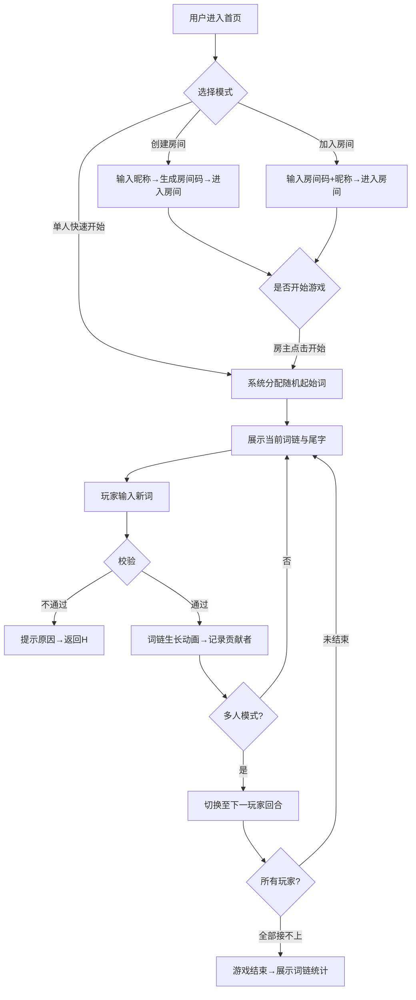

## 1. 产品概述

"脑洞大开花式接词"是一款创意文字链式游戏，玩家以前一词的尾字为首字，创造新的词汇或短语，共同编织一条不断生长的词链。支持单人畅玩与多人房间围观模式，将传统成语接龙玩法升级为充满想象力的创意表达。

- 目标用户：所有喜欢文字游戏、追求创意表达的用户，适合休闲娱乐、朋友聚会、在线社交
- 核心价值：将文字游戏从"成语接龙"的束缚中解放，鼓励脑洞大开的创意表达；多人模式让游戏成为社交媒介

## 2. 核心功能

### 2.1 用户角色

| 角色 | 注册方式 | 核心权限 |
|------|---------|---------|
| 房主 | 创建房间自动生成身份 | 开始游戏、设置起始词、踢人、结束游戏 |
| 玩家 | 加入房间输入昵称 | 轮流接词、查看词链、围观模式旁观 |
| 围观者 | 加入房间选择围观 | 实时观看游戏进程、发送表情互动（可选） |

### 2.2 功能模块

1. **首页**：游戏介绍、创建/加入房间入口、单人快速开始
2. **游戏主界面**：词链可视化展示、接词输入区、玩家列表、房间信息
3. **房间系统**：房间创建、房间加入、房间码分享、在线人数显示

### 2.3 页面详情

| 页面名称 | 模块名称 | 功能描述 |
|---------|---------|---------|
| 首页 | Hero 区域 | 游戏标题动画、Slogan、起始词示例展示 |
| 首页 | 房间操作区 | 创建房间按钮、加入房间输入框+按钮、单人快速开始按钮 |
| 首页 | 玩法说明 | 三步骤卡片式说明、规则要点 |
| 游戏主界面 | 词链展示区 | 横向/流动式词链可视化、生长动画、当前尾字高亮 |
| 游戏主界面 | 接词输入区 | 输入框（含尾字提示）、提交按钮、校验反馈提示 |
| 游戏主界面 | 玩家信息区 | 房间码复制、房主标识、当前回合玩家高亮、围观人数 |
| 游戏主界面 | 互动表情区 | 快捷表情按钮（可选围观者互动） |
| 游戏主界面 | 历史记录 | 词链滚动条、快速定位 |

## 3. 核心流程

用户进入首页后选择"单人快速开始"直接进入游戏，或创建/加入房间进入多人模式。游戏开始时系统随机给出起始词，玩家需输入包含上一词尾字的新词，系统校验通过后词链生长并切换至下一玩家，直到玩家主动结束或接不上词为止。

## 4. 用户界面设计

### 4.1 设计风格

- **设计基调**：梦幻彩虹涂鸦风，充满创意和想象力的视觉体验
- **主色**：渐变紫蓝色系（#6366F1 → #8B5CF6 → #EC4899），传达创意与梦幻感
- **辅助色**：霓虹绿 #10B981（成功）、琥珀橙 #F59E0B（警告）、珊瑚红 #F43F5E（错误）
- **按钮风格**：圆润胶囊形、微光渐变、悬浮时轻微弹跳放大
- **字体**：展示字体使用"ZCOOL KuaiLe"（站酷快乐体，活泼有趣），正文字体"Noto Sans SC"
- **布局风格**：卡片式浮动布局，背景使用微妙的渐变网格 + 噪点纹理
- **图标风格**：emoji 为主，辅以线条圆润的 SVG 图标

### 4.2 页面设计概述

| 页面名称 | 模块名称 | UI 元素 |
|---------|---------|---------|
| 首页 | Hero 区域 | 大号渐变标题 + 浮动示例词链（CSS 动画循环）、副标题半透明浮层 |
| 首页 | 房间操作区 | 三栏卡片布局，每个卡片带不同渐变边框，hover 轻微上浮 |
| 首页 | 玩法说明 | 三步骤时间轴设计，数字使用大号渐变圆形徽章 |
| 游戏主界面 | 词链展示区 | 横向流动卡片链，每个词块带连接线动画，新词语从右侧滑入+缩放弹出 |
| 游戏主界面 | 接词输入区 | 输入框带尾字提示标签，提交按钮带脉冲动画光圈 |
| 游戏主界面 | 玩家信息区 | 头像列表（首字母圆形）+ 状态点，当前回合玩家带发光边框 |
| 游戏主界面 | 背景效果 | 浮动彩色光斑 + 细微粒子动画，营造梦幻氛围 |

### 4.3 响应式

- **桌面优先**，移动端自适应布局
- 词链在移动端改为垂直排列，支持上下滑动查看
- 输入区在移动端固定底部，方便单手操作
- 房间码在移动端提供一键分享调用系统分享 API

### 4.4 动效重点

1. **词链生长动画**：新词从右端滑入 → 弹性缩放 → 连接线延伸绘制（SVG stroke-dasharray）
2. **词块悬浮**：hover 时轻微上浮 + 阴影加深 + 内部发光
3. **校验反馈**：成功时绿色脉冲圈扩散，失败时输入框左右抖动 + 红色光晕
4. **页面切换**：首页→游戏使用渐变透明过渡 + 轻微缩放
5. **玩家回合切换**：头像发光环渐变色流动动画
