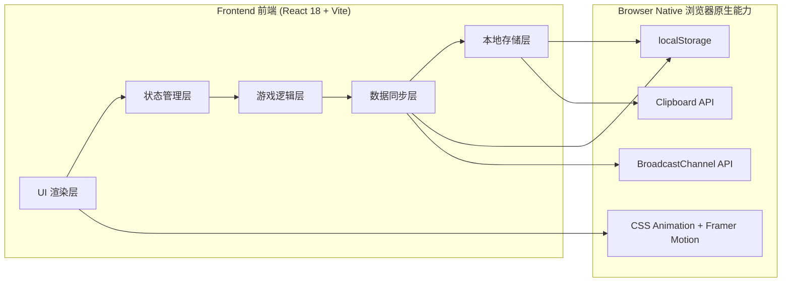
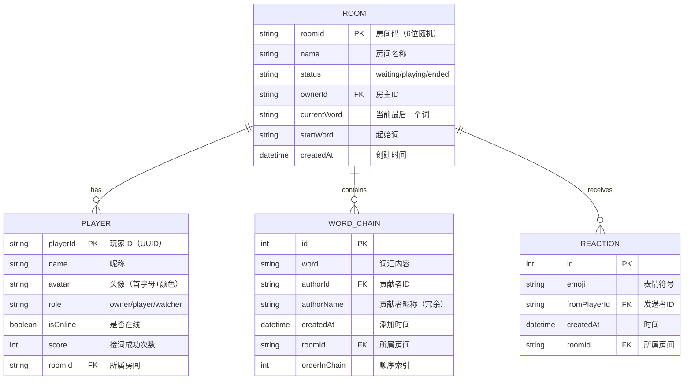

## 1. 架构设计



## 2. 技术说明

- **前端框架**：React@18 + TypeScript + Vite@6
- **样式方案**：TailwindCSS@3 + 自定义 CSS 变量（渐变、动画关键帧）
- **动画库**：Framer Motion（复杂时序动画）+ CSS Keyframes（基础循环动画）
- **状态管理**：React Context + useReducer（游戏状态）+ zustand（轻量全局状态）
- **多人同步方案**：BroadcastChannel API（同浏览器多标签页通信）+ localStorage（状态持久化）
- **后端**：无（纯前端 P2P 模式，后续可扩展 WebSocket 服务端）
- **数据**：内置起始词库 Mock 数据（100+ 精选起始词）

## 3. 路由定义

| 路由 | 用途 |
|------|------|
| `/` | 首页：Hero 展示、模式选择、玩法说明 |
| `/game/solo` | 单人游戏界面 |
| `/room/:roomId` | 多人房间（包含等待室 + 游戏中界面） |

## 4. 核心数据模型

### 4.1 数据模型定义



### 4.2 TypeScript 类型定义

```typescript
// 玩家
interface Player {
  id: string;
  name: string;
  color: string;
  role: 'owner' | 'player' | 'watcher';
  score: number;
  isOnline: boolean;
  lastActive: number;
}

// 词链节点
interface ChainWord {
  id: string;
  word: string;
  authorId: string;
  authorName: string;
  authorColor: string;
  timestamp: number;
  order: number;
}

// 房间状态
interface Room {
  id: string;
  name: string;
  status: 'waiting' | 'playing' | 'ended';
  ownerId: string;
  currentWord: string;
  startWord: string;
  chain: ChainWord[];
  players: Player[];
  currentTurnPlayerId: string | null;
  createdAt: number;
  reactions: { emoji: string; from: string; ts: number }[];
}

// 校验结果
interface ValidationResult {
  valid: boolean;
  reason?: 'empty' | 'too_short' | 'start_mismatch' | 'duplicate' | 'contains_last_char';
  message: string;
}

// BroadcastChannel 消息类型
interface ChannelMessage {
  type: 'sync-room' | 'join-room' | 'leave-room' | 'add-word' | 'start-game' | 'reaction' | 'kick-player';
  payload: any;
  senderId: string;
  timestamp: number;
}
```

## 5. 组件结构

```
src/
├── components/
│   ├── home/
│   │   ├── HeroSection.tsx      # 首页英雄区+动画
│   │   ├── ModeSelector.tsx     # 三种模式选择卡片
│   │   └── HowToPlay.tsx        # 玩法说明时间轴
│   ├── game/
│   │   ├── WordChainDisplay.tsx # 词链可视化展示（核心动画）
│   │   ├── WordBlock.tsx        # 单个词块组件
│   │   ├── ChainConnector.tsx   # 词块连接线（SVG动画）
│   │   ├── WordInputArea.tsx    # 接词输入+校验反馈
│   │   └── EndGameModal.tsx     # 游戏结束弹窗统计
│   ├── room/
│   │   ├── PlayerList.tsx       # 玩家列表+回合指示
│   │   ├── RoomHeader.tsx       # 房间信息+房间码复制
│   │   ├── WaitingRoom.tsx      # 等待室界面
│   │   └── ReactionBar.tsx      # 表情互动栏
│   └── shared/
│       ├── AnimatedGradientBg.tsx  # 渐变动画背景
│       ├── FloatingParticles.tsx   # 浮动粒子效果
│       ├── Avatar.tsx              # 头像组件
│       └── Button.tsx              # 通用胶囊按钮
├── pages/
│   ├── HomePage.tsx
│   ├── SoloGamePage.tsx
│   └── RoomPage.tsx
├── store/
│   ├── useRoomStore.ts         # zustand 房间状态管理
│   └── useGameStore.ts         # 单人游戏状态
├── hooks/
│   ├── useBroadcastChannel.ts  # 多人通信封装
│   ├── useWordValidation.ts    # 接词校验逻辑
│   └── useTurnManager.ts       # 回合制管理
├── utils/
│   ├── wordDatabase.ts         # 起始词库
│   ├── roomCodeGenerator.ts    # 房间码生成
│   └── colorPalette.ts         # 玩家颜色分配
├── styles/
│   └── animations.css          # 全局动画关键帧
└── App.tsx
```

## 6. 核心算法逻辑

### 6.1 接词校验规则

```
校验优先级：
1. 非空 & 长度 ≥ 2
2. 新词首字 == 上一词尾字（核心规则）
   ✅ "程序员" → "猿猴"（员=猿，同音不同字也可，放宽规则）
   ✅ 严格模式：首字完全相同
3. 词链中未出现过（避免重复循环）
4. 可选：包含上一词尾字即可（花式模式，更自由）
```

### 6.2 BroadcastChannel 同步策略

1. **创建房间**：生成 roomId → 初始化 localStorage[`room:${roomId}`] → 创建 channel
2. **加入房间**：通过 channel 发送 `join-room` → 房主（或任意存活标签页）广播 `sync-room` 发送完整状态
3. **状态变更**：任意修改都先更新 localStorage → 再通过 channel 广播增量消息
4. **心跳保活**：每 5s 广播 player-active，30s 未收到视为离线
5. **离线恢复**：新标签页加入 → 从 localStorage 恢复 → channel 请求最新状态
